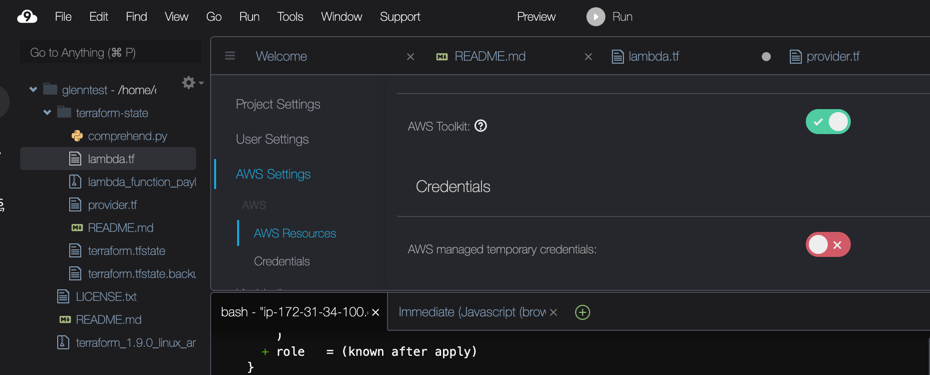

# Øvelse: Terraform-konfigurasjon med AWS S3, Providers, og State Management

## Mål

I denne øvelsen vil du lære hvordan du konfigurerer Terraform, inkludert både provider og backend. 

Som et eksempel finner du også i dette repoet Terraform-kode som oppretter en AWS Lambda-funksjon. Denne Lambda-funksjonen kaller på AWS-tjenesten Comprehend for å analysere tekst. 

Vi vil også bruke AWS S3 for å lagre Terraform state-filen ved å konfigurere en "backend" i Terraform.

## AWS Comprehend

AWS Comprehend er en språkforståelsestjeneste som bruker maskinlæring for å avdekke innsikt og relasjoner i tekst. Tjenesten kan automatisk analysere tekst for å identifisere sentiment, nøkkelbegreper, språk, emner og entiteter som navn, steder eller organisasjoner, noe som gjør den nyttig for alt fra kundeserviceanalyse til innholdsklassifisering og tekstforståelse.


## Beskrivelse av lambda-funksjonen i dette repositoriet 

Denne Lambda-funksjonen er konfigurert til å bruke Amazon Comprehend for tekstanalyse, spesielt sentimentanalyse. Lambda-funksjonen kjører i Python 3.8, og benytter en IAM-rolle som tillater full tilgang til Comprehend gjennom policyen comprehend:*. Funksjonen eksponeres via en Lambda URL med offentlig tilgang uten autentisering, og logger sendes til CloudWatch med en oppbevaringsperiode på 7 dager. Kildekoden pakkes som en ZIP-fil og lastes opp via Terraform. Etter deploy får du URL-en som output, slik at funksjonen kan testes med POST-forespørsler for å analysere tekst ved hjelp av Amazon Comprehend.

Denne Lambda-funksjonen bruker mekanismen `Function URL`, som gir en enkel HTTP-endepunkt for å kalle funksjonen direkte, uten behov for en HTTP API Gateway trigger. Dette forenkler oppsettet og reduserer kompleksiteten, samtidig som det gir en rask måte å eksponere funksjonen på for testing og integrasjon.

## Del 1: Kloning av repository og oppsett av Cloud9

### Åpne ditt AWS Cloud9-miljø

- Start med å logge inn i AWS Cloud9.
- Lag en klone av dette repositoryet.

### Se på koden

* Se på lambda.tf Se på ressursene. Kopier gjerne hele filen inn i ChatGPT og be om en forklaring. Spør foreleser om noe er uklart.
* Se på comprehend.py og forsikre deg om at du forstår koden


### Deaktiver standardrettigheter i Cloud9

Cloud9 kommer med et sett av standardrettigheter som er tilstrekkelige for mange bruksscenarioer. Men Cloud9 kan ikke opprette IAM-roller. I denne laben må vi derfor deaktivere **Cloud9 Managed temporary credentials**.

Trykk på "9"-ikonet øverst til venstre, og velg "Preferences". Deaktiver `AWS Managed temporary credentials`.



Deretter må vi lagre egne IAM-nøkler, som vi har gjort i tidligere øvinger. I Cloud9-terminalen bruker vi kommandoen:

```bash
aws configure
```

- Bruk `eu-west-1` som region.
- Bruk `json` som output format.

### Installer Terraform

Hvis Terraform ikke allerede er installert i ditt Cloud9-miljø, installer det ved å følge instruksjonene fra forrige del.

```bash
wget https://releases.hashicorp.com/terraform/1.9.0/terraform_1.9.0_linux_amd64.zip
unzip terraform_1.9.0_linux_amd64.zip
sudo mv terraform /usr/local/bin/
terraform -v
```

Installer `jq` som hjelper oss med å formatere JSON:

```bash
sudo yum install -y jq
```

---

## Del 2: Konfigurasjon av provider

### Required Providers og provider-versjonering

Start med å opprette en fil som heter `provider.tf` i ditt prosjekt. Denne filen definerer Terraform-konfigurasjonen din, inkludert hvilken provider som skal brukes, og spesifiserer providerens versjon.

```hcl
terraform {
  required_version = ">= 1.0"  # Krever minst versjon 1.0 av Terraform
  required_providers {
    aws = {
      source  = "hashicorp/aws"
      version = "~> 4.0"  # Bruker AWS-provider versjon 4.x
    }
  }
}

provider "aws" {
  region = "eu-west-1"  # Velg ønsket region
}
```

#### Forklaring:

- `required_version` definerer hvilken versjon av Terraform som er nødvendig.
- `required_providers` definerer hvilke providere Terraform trenger for å kjøre konfigurasjonen. I dette tilfellet bruker vi `aws`-provider fra HashiCorp.
- `version = "~> 4.0"` sørger for at Terraform bruker versjon 4.x av AWS-provideren, men vil tillate oppdateringer innenfor denne store versjonen (altså opp til, men ikke inkludert, 5.0). Dette sikrer stabilitet i konfigurasjonen.

### Oppgaver

- Forsøk å endre `required_version` for Terraform til en nyere versjon enn du har installert i Cloud9 og forsøk å gjøre en `terraform init`. Hva skjer? Endre tilbake.
- Kjør `terraform apply --auto-approve --var "prefix=<studentnavn>"`. Legg merke til at du får en `terraform.tfstate` fil i katalogen din, forsikre deg om at du vet hvorfor. Spør gjerne ChatGPT 😊.
- Vær sikker på at du forstår `--var` argumentet!

Du kan teste Lambda-funksjonen med følgende kommando. URL ser du etter en apply som en output:

```bash
$URL=<output fra terraform, verdien til `Terraform Function` sin URL>
curl -X POST $URL -H "Content-Type: application/json" -d '{"text": "Ladies and gentlemen, brace yourselves for the most groundbreaking cinematic experience in the history of humankind—*Sharknado*! This film is not just a movie; it is a transcendent work of art that redefines the very essence of filmmaking."}' | jq
```

---

## Del 3: Bruk S3 som backend for Terraform state

### Konfigurer S3 som backend for Terraform state

Legg til følgende konfigurasjon inn `terraform {}`-blokken i `provider.tf`:

```hcl
backend "s3" {
  bucket = "pgr301-2024-terraform-state"
  key    = "<studentnavn>-state-lab.tfstate"
  region = "eu-west-1"
}
```

#### Forklaring:

- `backend "s3"` konfigurerer Terraform til å bruke S3 som backend for state-filen.
- `bucket` refererer til navnet på S3-bucketen som skal lagre state-filen. Denne finnes fra før, og vi deler alle på denne.
- `key` spesifiserer stien til state-filen i S3-bucketen. Dette er filnavnet Terraform bruker for å lagre tilstanden (bytt ut `<studentnavn>`).
- `region` spesifiserer hvilken AWS-region som brukes for S3-bucketen.

### Initialiser Terraform

For å unngå at tidligere Terraform-konfigurasjoner forstyrrer, kjør følgende kommandoer for å slette all tidligere Terraform-konfigurasjon:

```bash
rm -rf .terraform 
rm terraform.tfstate*
```

Kjør deretter følgende kommando for å konfigurere Terraform til å bruke den definerte S3-backenden:

```bash
terraform init
```

- Legg merke til at du ikke har noen `terraform.tfstate`-fil på ditt lokale filsystem!
- Sjekk state-filen i S3.

Når provisjoneringen er ferdig, kan du gå til AWS-konsollen, finne S3-bucketen du har satt opp som backend, og bekrefte at `terraform.tfstate`-filen er opprettet på plassen du valgte.

### Provisjoner AWS Lambda-funksjonen på nytt

Etter å ha initialisert Terraform, kan du kjøre planleggings- og provisjoneringsprosessen:

```bash
terraform plan -var "prefix=<student_name>"
terraform apply --auto-approve -var "prefix=<student_name>"
```

#### Forklaring:

- `terraform plan` viser deg hva som kommer til å bli opprettet eller endret i AWS.
- `terraform apply` vil faktisk opprette de definerte ressursene.

#### Terraform avanserte state kommandoer 

- Prøv å kjøre `terraform state list` - du vil se de ressursene Terraform "kjenner til"
- Prøv å kjøre `terraform state rm aws_lambda_function.comprehend_lambda`
- Kjør så terraform plan - hva skjer? Hvorfor vil Terraform lage Lambda på nytt? 

## Del 4: Rydd opp

Når du er ferdig med øvelsen, er det viktig å rydde opp ressursene for å unngå unødvendige kostnader. Du kan slette ressursene ved å kjøre:

```bash
terraform destroy --auto-approve
```

---

## Oppsummering

I denne øvelsen har du lært hvordan du konfigurerer Terraform med `required_providers`, hvordan du bruker versjonering av providere for å sikre stabilitet, hvordan du provisjonerer en S3-bucket, og hvordan du bruker S3 som backend for Terraform state-filer. Du har nå en bedre forståelse av hvordan Terraform håndterer infrastruktur som kode på en sikker og skalerbar måte.
